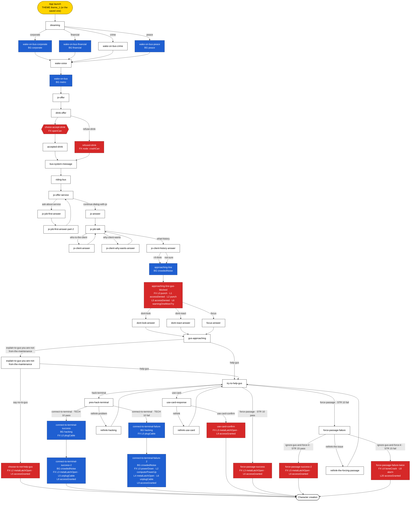

# Prologue sound mapping

Every sound dispatched by `prologue.ts`, laid over the chapter's node graph.

- **Theme / background** share one slot and loop until another theme or background replaces them. The last one is saved and plays again when the app reopens.
- **Effects** play once, on top of whatever theme or background is playing.
- **Where a sound fires**: on a node (when the node opens), on a line (when that line's page opens), or on a choice (when the player picks it).

## Graph

Yellow nodes start a theme, blue nodes start a background, red nodes have effects, and white nodes have no sound. A node that starts a theme or background and also has effects takes the theme/background color, since that's what keeps playing afterwards. Edge labels are choice ids; dice choices show the roll and its outcome. A choice that plays a sound is drawn as its own hexagon node (`choice <id>`) in its sound's color.

## Theme / background timeline

| From                                                  | Plays                                                 | Until                                                                               |
| ----------------------------------------------------- | ----------------------------------------------------- | ----------------------------------------------------------------------------------- |
| App launch                                            | `theme_1.mp3` (or the saved theme/background)         | a dream background starts, or `wake-on-bus` opens (the crime dream keeps the theme) |
| `wake-on-bus-corporate` (node)                        | `background_corporate.mp3`                            | `wake-on-bus` opens (plays through `wake-voice`)                                    |
| `wake-on-bus-financial` (node)                        | `background_financial.mp3`                            | `wake-on-bus` opens (plays through `wake-voice`)                                    |
| `wake-on-bus-peace` (node)                            | `background_peace.mp3`                                | `wake-on-bus` opens (plays through `wake-voice`)                                    |
| `wake-on-bus` (node)                                  | `background_metro.mp3`                                | `approaching-line` opens                                                            |
| `approaching-line` (node)                             | `background_crowded_noise.mp3`                        | end of the prologue, unless the hacking path replaces it                            |
| `connect-to-terminal-success` / `-failure` (node)     | `background_hacking.mp3`                              | the matching `-2` node opens                                                        |
| `connect-to-terminal-success-2` / `-failure-2` (node) | `background_crowded_noise.mp3` (back from cyberspace) | end of the prologue                                                                 |

`theme_2.mp3` is not used in the prologue.

## Every sound, in story order

| Node                            | Fires on              | Type       | Constant                              | File                              | Moment                                                            |
| ------------------------------- | --------------------- | ---------- | ------------------------------------- | --------------------------------- | ----------------------------------------------------------------- |
| `wake-on-bus-corporate`         | node                  | background | `SOUND_FILE_BACKGROUNDS.corporate`    | `background_corporate.mp3`        | Dreaming of the top floor of a high-rise                          |
| `wake-on-bus-financial`         | node                  | background | `SOUND_FILE_BACKGROUNDS.financial`    | `background_financial.mp3`        | Dreaming of a quiet home with money in the bank                   |
| `wake-on-bus-peace`             | node                  | background | `SOUND_FILE_BACKGROUNDS.peace`        | `background_peace.mp3`            | Dreaming of wind through the leaves outside a small house         |
| `wake-on-bus`                   | node                  | background | `SOUND_FILE_BACKGROUNDS.metro`        | `background_metro.mp3`            | Waking up on the bus                                              |
| `drink-offer`                   | choice `accept-drink` | effect     | `SOUND_EFFECT_FILE.openCan`           | `effect_open_can.wav`             | Opening the can Jô offers                                         |
| `refused-drink`                 | node                  | effect     | `SOUND_EFFECT_FILE.crashCan`          | `effect_crash_can.mp3`            | Jô crushes the can and throws it away                             |
| `approaching-line`              | node                  | background | `SOUND_FILE_BACKGROUNDS.crowdedNoise` | `background_crowded_noise.mp3`    | The crowd at the factory turnstiles                               |
| `approaching-line-gus-blocked`  | line 0                | effect     | `SOUND_EFFECT_FILE.punch`             | `effect_punch.mp3`                | Gus punching the access terminal                                  |
| `approaching-line-gus-blocked`  | line 1                | effect     | `SOUND_EFFECT_FILE.accessDenied`      | `effect_denied.wav`               | "CREDENCIAL NÃO IDENTIFICADA"                                     |
| `approaching-line-gus-blocked`  | line 2                | effect     | `SOUND_EFFECT_FILE.punch`             | `effect_punch.mp3`                | The machine takes another punch                                   |
| `approaching-line-gus-blocked`  | line 5                | effect     | `SOUND_EFFECT_FILE.accessDenied`      | `effect_denied.wav`               | "CREDENCIAL NÃO IDENTIFICADA"                                     |
| `approaching-line-gus-blocked`  | line 6                | effect     | `SOUND_EFFECT_FILE.warningOneMoreTry` | `effect_warning_one_more_try.mp3` | One more try before the credential locks                          |
| `choose-to-not-help-gus`        | line 2                | effect     | `SOUND_EFFECT_FILE.metalLatchOpen`    | `effect_metal_latch_open.mp3`     | Your turnstile unlocks                                            |
| `choose-to-not-help-gus`        | line 5                | effect     | `SOUND_EFFECT_FILE.accessGranted`     | `effect_granted.wav`              | "RECONHECIMENTO CONFIRMADO!"                                      |
| `connect-to-terminal-success`   | node                  | background | `SOUND_FILE_BACKGROUNDS.hacking`      | `background_hacking.mp3`          | You enter cyberspace                                              |
| `connect-to-terminal-success`   | line 0                | effect     | `SOUND_EFFECT_FILE.plugCable`         | `effect_plug_cable.mp3`           | The cable from your temple plugs into the terminal                |
| `connect-to-terminal-success-2` | node                  | background | `SOUND_FILE_BACKGROUNDS.crowdedNoise` | `background_crowded_noise.mp3`    | The terminal noise comes back as you return to your body          |
| `connect-to-terminal-success-2` | line 3                | effect     | `SOUND_EFFECT_FILE.metalLatchOpen`    | `effect_metal_latch_open.mp3`     | The latch pulls back for Gus                                      |
| `connect-to-terminal-success-2` | line 5                | effect     | `SOUND_EFFECT_FILE.unplugCable`       | `effect_unplug_cable.mp3`         | The cable retracts into your temple                               |
| `connect-to-terminal-success-2` | line 8                | effect     | `SOUND_EFFECT_FILE.accessGranted`     | `effect_granted.wav`              | "RECONHECIMENTO CONFIRMADO!"                                      |
| `connect-to-terminal-failure`   | node                  | background | `SOUND_FILE_BACKGROUNDS.hacking`      | `background_hacking.mp3`          | You enter cyberspace                                              |
| `connect-to-terminal-failure`   | line 0                | effect     | `SOUND_EFFECT_FILE.plugCable`         | `effect_plug_cable.mp3`           | The cable from your temple plugs into the terminal                |
| `connect-to-terminal-failure-2` | node                  | background | `SOUND_FILE_BACKGROUNDS.crowdedNoise` | `background_crowded_noise.mp3`    | You're thrown back into your body at the turnstiles               |
| `connect-to-terminal-failure-2` | line 0                | effect     | `SOUND_EFFECT_FILE.powerDown`         | `effect_power_down.mp3`           | The terminal shuts off                                            |
| `connect-to-terminal-failure-2` | line 2                | effect     | `SOUND_EFFECT_FILE.computerPowerUp`   | `effect_computer_power_up.mp3`    | The New Human logo boots up                                       |
| `connect-to-terminal-failure-2` | line 4                | effect     | `SOUND_EFFECT_FILE.metalLatchOpen`    | `effect_metal_latch_open.mp3`     | The turnstile lets Gus through                                    |
| `connect-to-terminal-failure-2` | line 6                | effect     | `SOUND_EFFECT_FILE.unplugCable`       | `effect_unplug_cable.mp3`         | You pull the cable out and guide it back into your temple         |
| `connect-to-terminal-failure-2` | line 9                | effect     | `SOUND_EFFECT_FILE.accessGranted`     | `effect_granted.wav`              | "RECONHECIMENTO CONFIRMADO!"                                      |
| `use-card-confirm`              | line 3                | effect     | `SOUND_EFFECT_FILE.metalLatchOpen`    | `effect_metal_latch_open.mp3`     | The locks retract with a metallic snap                            |
| `use-card-confirm`              | line 9                | effect     | `SOUND_EFFECT_FILE.accessGranted`     | `effect_granted.wav`              | "RECONHECIMENTO CONFIRMADO!"                                      |
| `force-passage-success`         | line 3                | effect     | `SOUND_EFFECT_FILE.metalLatchOpen`    | `effect_metal_latch_open.mp3`     | Your turnstile unlocks                                            |
| `force-passage-success`         | line 6                | effect     | `SOUND_EFFECT_FILE.accessGranted`     | `effect_granted.wav`              | "RECONHECIMENTO CONFIRMADO!"                                      |
| `force-passage-success-2`       | line 5                | effect     | `SOUND_EFFECT_FILE.metalLatchOpen`    | `effect_metal_latch_open.mp3`     | You pass through your turnstile                                   |
| `force-passage-success-2`       | line 6                | effect     | `SOUND_EFFECT_FILE.accessGranted`     | `effect_granted.wav`              | "RECONHECIMENTO CONFIRMADO!"                                      |
| `force-passage-failure-twice`   | line 6                | effect     | `SOUND_EFFECT_FILE.boneCrack`         | `effect_bone_break.mp3`           | Your arms slam into the turnstile                                 |
| `force-passage-failure-twice`   | line 8                | effect     | `SOUND_EFFECT_FILE.alarm`             | `effect_alarm.mp3`                | The guard hits the wall alarm                                     |
| `force-passage-failure-twice`   | line 20               | effect     | `SOUND_EFFECT_FILE.accessGranted`     | `effect_granted.wav`              | "RECONHECIMENTO CONFIRMADO! Funcionário encaminhado à enfermagem" |

## By sound file

| File                              | Type       | Used in                                                                                                                                                                              |
| --------------------------------- | ---------- | ------------------------------------------------------------------------------------------------------------------------------------------------------------------------------------ |
| `theme_1.mp3`                     | theme      | App launch (default)                                                                                                                                                                 |
| `theme_2.mp3`                     | theme      | not used                                                                                                                                                                             |
| `background_corporate.mp3`        | background | `wake-on-bus-corporate`                                                                                                                                                              |
| `background_financial.mp3`        | background | `wake-on-bus-financial`                                                                                                                                                              |
| `background_peace.mp3`            | background | `wake-on-bus-peace`                                                                                                                                                                  |
| `background_metro.mp3`            | background | `wake-on-bus`                                                                                                                                                                        |
| `background_hacking.mp3`          | background | `connect-to-terminal-success`, `connect-to-terminal-failure`                                                                                                                         |
| `background_crowded_noise.mp3`    | background | `approaching-line`, `connect-to-terminal-success-2`, `connect-to-terminal-failure-2`                                                                                                 |
| `effect_open_can.wav`             | effect     | `drink-offer` → `accept-drink`                                                                                                                                                       |
| `effect_crash_can.mp3`            | effect     | `refused-drink`                                                                                                                                                                      |
| `effect_punch.mp3`                | effect     | `approaching-line-gus-blocked` L0, L2                                                                                                                                                |
| `effect_denied.wav`               | effect     | `approaching-line-gus-blocked` L1, L5                                                                                                                                                |
| `effect_warning_one_more_try.mp3` | effect     | `approaching-line-gus-blocked` L6                                                                                                                                                    |
| `effect_granted.wav`              | effect     | every path's final "RECONHECIMENTO CONFIRMADO!" (7 nodes)                                                                                                                            |
| `effect_power_down.mp3`           | effect     | `connect-to-terminal-failure-2` L0                                                                                                                                                   |
| `effect_computer_power_up.mp3`    | effect     | `connect-to-terminal-failure-2` L2                                                                                                                                                   |
| `effect_metal_latch_open.mp3`     | effect     | `choose-to-not-help-gus` L2, `connect-to-terminal-success-2` L3, `connect-to-terminal-failure-2` L4, `use-card-confirm` L3, `force-passage-success` L3, `force-passage-success-2` L5 |
| `effect_plug_cable.mp3`           | effect     | `connect-to-terminal-success` L0, `connect-to-terminal-failure` L0                                                                                                                   |
| `effect_unplug_cable.mp3`         | effect     | `connect-to-terminal-success-2` L5, `connect-to-terminal-failure-2` L6                                                                                                               |
| `effect_bone_break.mp3`           | effect     | `force-passage-failure-twice` L6                                                                                                                                                     |
| `effect_alarm.mp3`                | effect     | `force-passage-failure-twice` L8                                                                                                                                                     |
